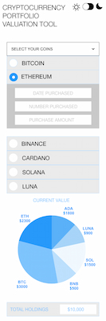
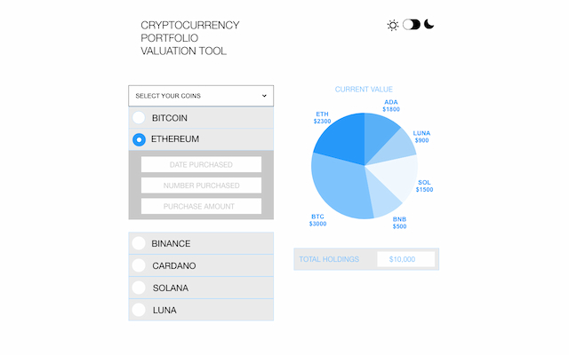
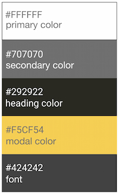
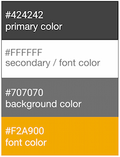
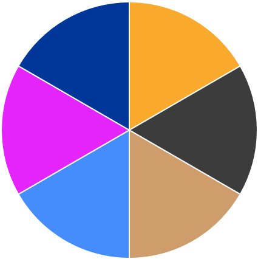
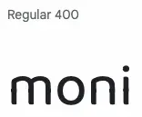

# Cryptocurrency Portfolio Valuation Tool

This website is designed and created for the Interactive Frontend Development Milestone Project, for Code Institute's Diploma in Web Application Development. 

Moni - Cryptocurrency Portfolio Valution Tool is a digital currency calculator built to quickly calculate the value of crypto assets.

[Enter the site](https://petecookson.github.io/moni/)

## Table of Contents

-   [User Stories](#user-stories)
    -   [External user goals](#external-user-goals)
    -   [Returning external user goals](#returning-external-user-goals)
    -   [Site owner goals](#site-owner-goals)
-   [The 5 Planes of User Experience...](#5-planes)
    -   [Strategy Plane](#strategy-plane)
    -   [Scope Plane](#scope-plane)
    -   [Structure Plane](#structure-plane)
    -   [Skeleton Plane](#skeleton-plane)
    -   [Surface Plane](#surface-plane)
-   [Technologies Used](#technologies-used)
-   [Resources](#resources)
-   [Testing](#testing)
-   [Bugs](#bugs)
-   [Responsiveness](#responsiveness)
-   [Life Cycle & Further Features](#life-cycle-&-further-features)
-   [User Stories - the outcome...](#user-stories---the-outcome...)
-   [Version Control](#version-control)
-   [Deployment](#deployment)
-   [Credits](#credits)

# User Stories:

### External user goals:
* Quickly understand the main purpose of the site.
* Navigate easily and identify relevant assets.
* Easily input data and return real time values of cryptocurrencies.
* To view a quick and simple visualisation of the value of current assets.
### Returning external user goals:
* Access real time cryptocurency values.
* Quickly access personal portfolio valuation.
* Be able to easily access contact information.
### Site owner goals:
* Increase the useability and understanding of crypto assets.
* Grow a following of users for further rollout of features.
* Develop further calculations to assist the user gaining information.

# The 5 Planes of User Experience...

## Strategy Plane
--- 
The website is built with the main aim being to create a clear, simple, and effective way to calculate live cryptocurrency assets; information is clear, intuitive, easy to use.

[Click here](readme/readme_images/moni-flowchart.png) to view the Flow Chart
## Scope Plane
---
Features included in this Project

* Direct user input and live crypto prices used for accurate portfolio calculation.
* Pie chart used to visually represent current holding values.
* Addtional information based on calculations the showing current value.
* Dark mode toggle to reduce eye strain and improve battery life.
* Information modal provding basic steps to using Moni.
* Contact option via email using client-side technology.

## Structure Plane
---
The website is built on a single page, having a specific purpose and formatted intuitively.
Layout of the page is simple and allows immediate interaction, buttons are clearly labelled and returned data 

## Skeleton Plane
---
The design has been focused on mobile first, while also being responsive to larger screens. The website was designed to allow immediate interaction and to be appropriate to the intended audience.

 
## Surface Plane
---

The palette and fonts used for the site is complementary to the design and uses minimal color and style variations for visual identity.
## Light mode Colors

## Dark mode Colors

## Chart Colors
Colors for the chart were chosen based on the main color for the logos of the representative cryptocurrency.

## Fonts
Google Fonts was used to import the selected fonts.
* Baloo Tamma 2 regular - Used for the logo.

* Raleway - Used for headings and body text.

## Technologies used
---
* [Git](https://git-scm.com/) Version control
* [GitHub](https://github.com/) Files, documents and deployment of the website
* [HTML5](https://en.wikipedia.org/wiki/HTML) Markup
* [CSS3](https://en.wikipedia.org/wiki/CSS) Stylesheet
* [Bootstrap](https://getbootstrap.com/) Structure and CDN for the website
* [Google Fonts](https://fonts.google.com/) Fonts
* [Font Awesome](https://fontawesome.com/) Icons
* [[adobeXD](https://www.adobe.com/uk/products/xd.html) Logo design
* [Squoosh](https://squoosh.app/) Image optimisation
* [PNG to WEBP](https://convertio.co) PNG conversion

## Resources
---
* [Code Institute](https://codeinstitute.net/) 
* [W3schools](https://www.w3schools.com/)
* [Stackoverflow](https://stackoverflow.com/)
* [Slack](https://slack.com/intl/en-gb/)

### Content
* [Dark Mode](https://dev.to/)dev.to
* [Modal](https://www.w3schools.com/)www.w3schools.com
* [Pricing API](https://coingecko.com/en/api)coingecko.com
* [Chart](https://www.chartjs.org/)www.chartjs.org
## Testing
---
The majority of initial browser testing was done through Chrome Developer Tools and Safari's Inspect Elements.
## Bugs
---
* Error with Permissions-Policy header: Unrecognized feature: 'interest-cohort'.
* Bug with sending email from the contact modal: safari deployed and remote server sends after "There was an error" alert is closed, chrome sends after second attempt

## Responsiveness
---
## Life Cycle & Further Features
---
* Create account to store portfolio information.
* Add a date purchased and amount input to further calculate more data including Return on Investment, Profit/Loss, Total Investment.
* Increase the number of coins available for portfolio calculation.

## User Stories - the outcome...
---
### In this development I wanted the new user to:
* Quickly understand the main purpose of the site.

* Navigate easily and identify relevant assets.

* Easily input data and return real time values of cryptocurrencies.

* To view a quick and simple visualisation of the value of current assets.

## Version Control
---
### Git & GitHub

I used **[GitPod](https://gitpod.io/)** as a local repository and IDE and **[GitHub](https://github.com/)** as a remote repository. The process of version control was:

* First i created a new repository on GitHub 
* I have then opened that repository on GitPod and started coding
* In GitPod i have created all the pages and and folders 
* I was then saving my work and pushing it to GitHub repository to keep it safe
* The process I used for checking, saving, commiting and pushing it to remote repository is:
    * `git status` for checking and displaying the state of the repository and staging area
   * `git add . `  for adding work to git
    * `git commit -m "Commit message" ` used for saving changes
    * `git push ` used to upload content to a Github
## Deployment
---
To deploy the website on [GitHub](https://github.com/).
1. Go to **"Settings"** in the repository
2. In **"Source"** of **"GitHub Pages"**, select **"master** for Branch and click save
3. The website is now published on GitHub Pages and the link is provided on on the same section
## Credits
---