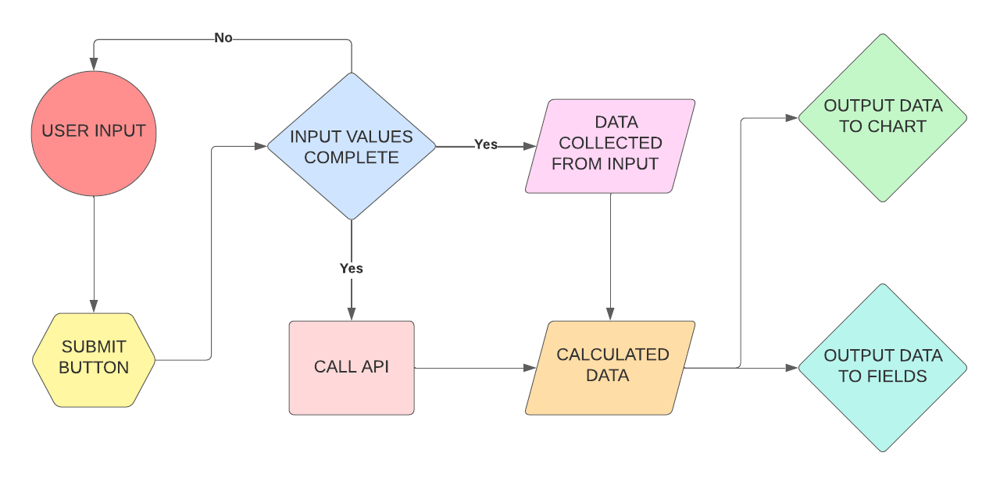
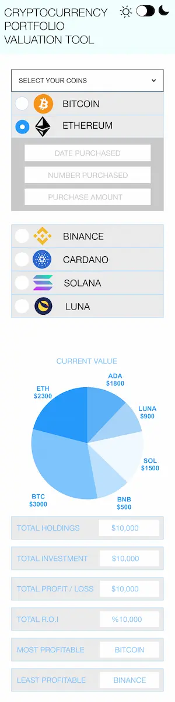

# Cryptocurrency Portfolio Valuation Tool

This website was designed and created for the Interactive Frontend Development Milestone Project, for Code Institute's Diploma in Web Application Development. 

The website can be [found here](https://petecookson.github.io/moni/).

## Table of Contents

-   [User Stories](#user-stories)
    -   [External user goals](#external-user-goals)
    -   [Returning external user goals](#returning-external-user-goals)
    -   [Site owner goals](#site-owner-goals)
-   [The 5 Planes of User Experience...](#5-planes)
    -   [Strategy Plane](#strategy-plane)
    -   [Scope Plane](#scope-plane)
    -   [Structure Plane](#structure-plane)
    -   [Skeleton Plane](#skeleton-plane)
    -   [Surface Plane](#surface-plane)
-   [Technologies Used](#technologies-used)
-   [Resources](#resources)
-   [Testing](#testing)
-   [Bugs](#bugs)
-   [Responsiveness](#responsiveness)
-   [Life Cycle & Further Features](#life-cycle-&-further-features)
-   [User Stories - the outcome...](#user-stories---the-outcome...)
-   [Version Control](#version-control)
-   [Deployment](#deployment)
-   [Credits](#credits)

# User Stories:

### External user goals:
* Quickly understand the main purpose of the site.
* Navigate easily and identify relevant assets.
* Easily input data and return real time values of cryptocurrencies.
* To view a quick and simple visualisation of the value of current assets.
### Returning external user goals:
* Access real time cryptocurency values.
* Quickly access personal portfolio valuation.
* Be able to easily access contact information.
### Site owner goals:
* Increase the useability and understanding of crypto assets.
* Grow a following of users for further rollout of features.
* Develop further calculations to assist the user gaining information.

# The 5 Planes of User Experience...

## Strategy Plane
---
### Flow Chart 

## Scope Plane
---
## Structure Plane
---
## Skeleton Plane
---

## Surface Plane
---

* Color palette
* Fonts

## Technologies used
---
* [Git](https://git-scm.com/) Version control
* [GitHub](https://github.com/) Files, documents and deployment of the website
* [HTML5](https://en.wikipedia.org/wiki/HTML) Markup
* [CSS3](https://en.wikipedia.org/wiki/CSS) Stylesheet
* [Bootstrap](https://getbootstrap.com/) Structure and CDN for the website
* [Google Fonts](https://fonts.google.com/) Fonts
* [Font Awesome](https://fontawesome.com/) Icons
* [[adobeXD](https://www.adobe.com/uk/products/xd.html) Logo
* [Squoosh](https://squoosh.app/) Image optimisation
* [PNG to WEBP](https://convertio.co) PNG conversion

## Resources
---
* [Code Institute](https://codeinstitute.net/) 
* [W3schools](https://www.w3schools.com/)
* [Stackoverflow](https://stackoverflow.com/)
* [Slack](https://slack.com/intl/en-gb/)
* 

### Content
* [Dark Mode](https://dev.to/)
* [Modal](https://www.w3schools.com/)
* [Pricing API](https://coingecko.com/en/api)
* [Chart](https://www.chartjs.org/)
## Testing
---
## Bugs
---
## Responsiveness
---
## Life Cycle & Further Features
---
## User Stories - the outcome...
---
## Version Control
---
## Deployment
---
## Credits
---